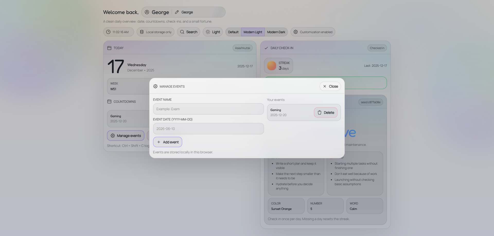
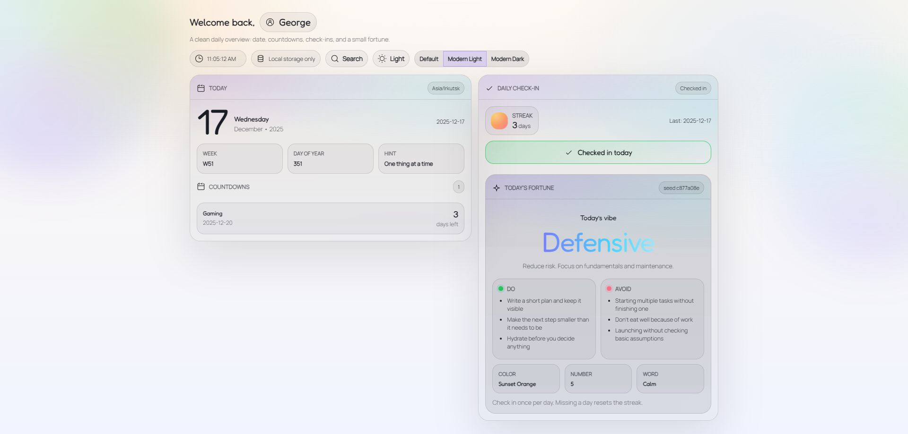
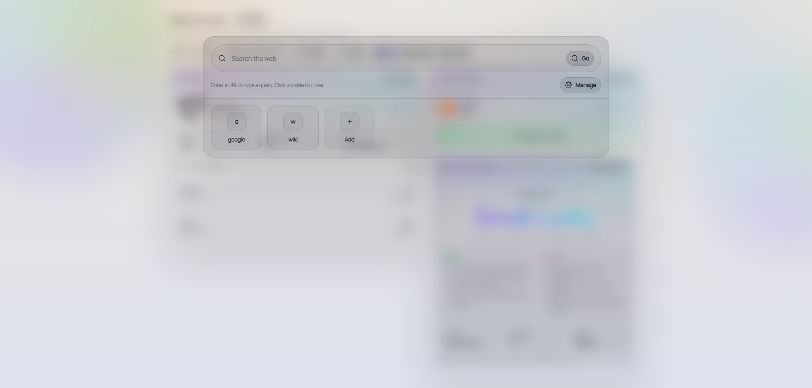
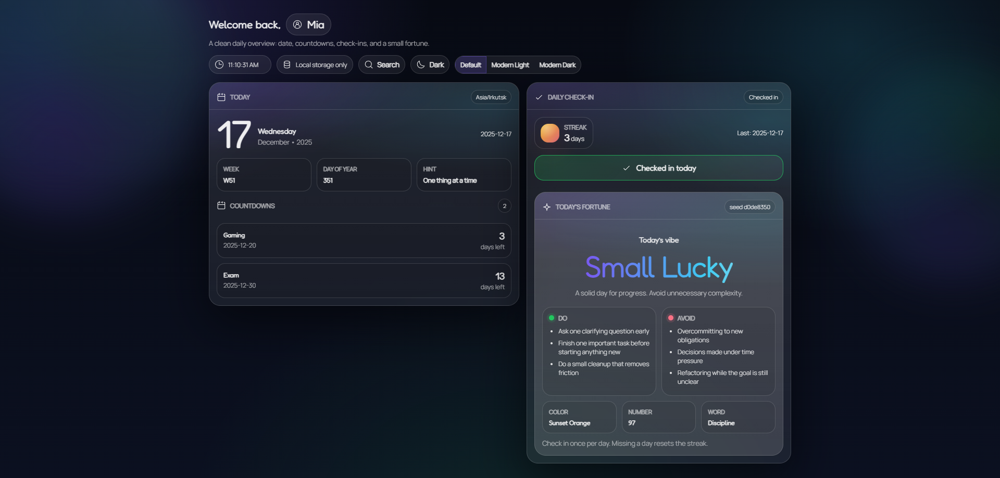

# NewTab‑Extended

A clean, customizable **new tab extension** for Chrome and Edge.

Designed to be calm, distraction‑free, and actually useful — with daily check‑ins, countdowns, and a small fortune system. Everything runs **locally**. No accounts. No tracking.

---

## ✨ Features

* 🗓️ **Daily overview** — date, week, day‑of‑year at a glance
* ✅ **Daily check‑in & streaks** — build consistency
* ⏳ **Countdowns** — keep important dates visible
* 🔮 **Daily fortune / focus hint** — small nudge, not spam
* 🎨 **Multiple themes** — Light, Modern Light, Modern Dark
* 💾 **Local‑only storage** — your data stays on your device
* ⚡ **Fast & lightweight** — zero bloat

---

## 🖼️ Preview






---

## 🚀 Installation

### From GitHub (Manual)

1. Download or clone this repository
2. Open Chrome / Edge and go to:

   ```
   chrome://extensions
   ```
3. Enable **Developer mode** (top‑right)
4. Click **Load unpacked**
5. Select the project folder

Open a new tab — NewTab‑Extended should now be active.

---

## 🛠️ Tech Stack

* HTML
* CSS (custom layout & theming)
* JavaScript (logic & storage)
* Chromium Extension APIs (Manifest V3)

---

## 📦 Project Structure

```
NewTab‑Extended/
├─ index.html
├─ style.css
├─ script.js
├─ manifest.json
├─ screenshots/
├─ icons/
├─ fonts/
├─ cursors/
└─ LICENSE
```

---

## 🔒 Privacy

* No analytics
* No network requests
* No accounts
* No tracking

All data is stored **locally in your browser**.

---

## 📄 License

This project is licensed under the **MIT License**.

**Note:** The project name, branding, icons, and visual assets are not covered by the MIT License and may not be reused without permission.

---

## 🌱 Status

Actively developed. Feedback and suggestions are welcome.

If you find it useful, a ⭐ on the repo is always appreciated 🙂
